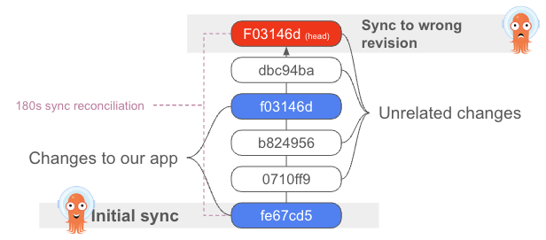

# ArgoCD Monorepo Controller Architecture

## Tracking Change Revisions with Monorepo.

Currently, in Monorepo configurations, ArgoCD cannot accurately track
Change Revisions: application state and history contains commits for
the entire Git repository, not specifically the [Change Revisions](terminology.md#change-revision)
that are relevant for the specific Application.

This has a lot of undesirable consequences from the users point of view:

* Bogus notifications on changes that are not relevant for the user's
  Application.
* Not-relevant entries in application history and timeline.
* Unneeded Application Synchronizations with no change in the manifests.

In large monorepo configurations, when there are hundreds of
applications sharing same Git repository, most of history entries and
notifications are bogus and do not contain relevant information for
Application users.

## The Monorepo Controller 

The Monorepo Controller is an add-on component for ArgoCD that
accurately tracks the commits that actually changed the application
(Change Revision).

It is a Kubernetes controller which continuously monitors ArgoCD
applications and handles changes in their Sync state [Git Revision](terminology.md#git-revision), 
calculates the commit that actually changed the application and 
records it in the Application Manifest [Change Revision](terminology.md#change-revision).

Putting it in a separate project gives a quick solution to for
tracking [Change Revisions](terminology.md#change-revision) to monorepo users without affecting
negatively ArgoCD performance or development.

This will as well allow us to use this controller as sort of
playground for finding the optimal ways for accurate tracking of
application changes, so in the future will be able more easily
incorporate this functionality into Argo-CD itself.

## Controller functionality

The controller watches the Application events (creation and change
in the application manifests) and updates the following
annotations to to indicate actual [Change Revision](terminology.md#change-revision) of the
applications:

* `mrp-controller.argoproj.io/change-revision` - Contains Application [Change Revision](terminology.md#change-revision).
* `mrp-controller.argoproj.io/change-revisions` - Contains a JSON List of [Change Revisions](terminology.md#change-revision) for each application source according to the order of Applicaton sources.
* `mrp-controller.argoproj.io/git-revision` - Contains Application [Git Revision](terminology.md#git-revision).
* `mrp-controller.argoproj.io/git-revisions` - Contains a JSON list of
  [Git Revisions](terminology.md#git-revision) for each application source according to the
  order of Applicaton sources.

For Helm Repository based application sources the entries will contain the
application version that is specified in the Helm `chart.yaml` file.

The controller saves in the
`mrp-controller.argoproj.io/git-revision(s)` annotations current Git
revision of the application sources, that allows it to avoid expensive
recalculation of the change revision when there is no actual change in
Git repository.

For multisource applications the `mrp-controller.argoproj.io/change-revision` 
and `mrp-controller.argoproj.io/git-revision` annotations contain the values
for the first application source only.

## The Manifest Generate Paths Annotation

This [`argocd.argoproj.io/manifest-generate-paths`](https://argo-cd.readthedocs.io/en/latest/operator-manual/high_availability/#manifest-paths-annotation)
Application annotation specifies which paths whithin the Git 
repository are used during manifest generation. Use of
this annotation is used by ArgoCD to avoid unnecessary
regeneration of Application manifests when it is known that 
they  won't be affected by the changes in the commit.

In Argo CD usage of this annotation is optional and only affects
synchronization performance and load on Git repositories.

The Monorepo Controller, however, uses this annotation to distinguish
between the changes that would affect and the application manifests
and those that wouldn't. In its current implementation the Monorepo
Controller won't handle the application that do not have 
this annotation set. 

Therefore, setting this annotation correctly is critical
for accurate tracking of [Application Change Revisions](terminology.md#change-revision)
by ArgoCD Monorepo Controller.

## The Initial Implementation and its Limitations

The initial controller version will only work for applications that
have the `argocd.argoproj.io/manifest-generate-paths` annotation
defined.  It will get list of revisions between currently synchronizing
(or last synchronized) git revision and previously synchronized 
git revision. Then it will use git `diff-tree` operation to each
revision in the list to determine if there are changed files and
will filter that list against the paths from the
`manifest-generate-paths` annotation.

## The Controller Components

Currently the ArgoCD Monorepo Controller consists of two components that 
are running in separate pods:

* argocd-monorepo-controller
* argocd-monorepo-repo-server

The former one is architecturally parallel to the ArgoCD application controller:
it listens to application events and updates application annotations.

The latter one is parallel to ArgoCD Repo Server: the former component
calls it to perform the actual calculation of [Change Revision](terminology.md#change-revision), which
includes actual checkout of Git repositories and running the `git
diff` operation.

Both components are supposed to run in the ArgoCD namespace and reuse
the relevant ArgoCD configuration (such as configuration of Git
repository connections, list of namespaces to handle applications,
etc.).

## Future plans

* Extend Argo-CD UI to display accurate [Change Revisions](terminology.md#change-revision).
* We'll try to introduce a more presize method for calculating the
  affected version that will run CM tools/plugins to determine if
  there was a change in manifests.
* We'll look into possible performance optimizations of the operations.

As the long-term goal, when the things will stabilize and performance
will look good, we'll start working on integrating the changes into
the upstream repository server as well as on extending properly the
Application CR and integrating the new functionality into the ArgoCD
source code.

